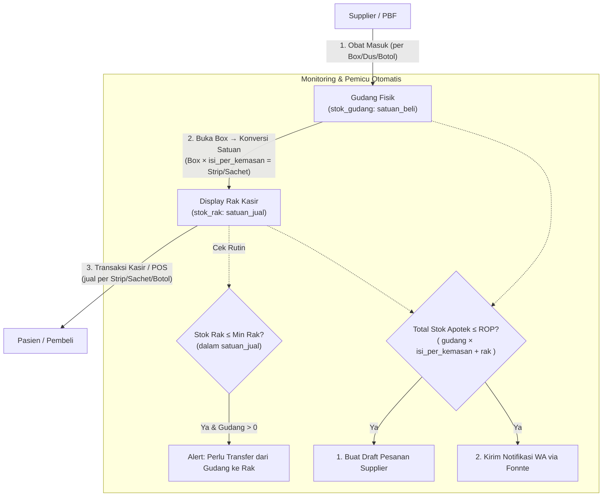

# Perancangan Sistem Informasi Manajemen Stok Obat
### Studi Kasus: Apotek Tabah Farma — Implementasi Laravel + FEFO + ROP + Fonnte (Multi-Lokasi & Satuan Bertingkat: Gudang & Display Rak + POS Kasir)

---

## 1. Arsitektur & Tech Stack

| Komponen | Pilihan | Catatan |
|---|---|---|
| Framework | Laravel 11 | Arsitektur MVC, Eloquent ORM, Service Layer Pattern |
| Database | MySQL | Relasional dengan ACID Transaction untuk konsistensi stok |
| Autentikasi | Laravel Breeze / Session Guard | Role-based: `admin`, `karyawan` (kasir/petugas gudang) |
| Notifikasi WA | Fonnte API | Integrasi WhatsApp Gateway untuk peringatan ROP & ED |
| Frontend | Blade + Tailwind CSS (TailAdmin Theme) | Responsif, Dark/Light mode, SVG Icons |
| Scheduler | Laravel Task Scheduling (`schedule:run`) | Pengecekan otomatis ROP & ED (Expired Date) harian |
| Queue | Database Queue Driver | Kirim notifikasi WA secara asinkron tanpa membebani kasir |
| Testing | PHPUnit + BlackBox Testing | Pengujian fungsional skenario bisnis apotek |

---

## 2. Ringkasan Revisi Perancangan Sistem

| Aspek | Perancangan Awal | Revisi Final (Multi-Lokasi + Satuan Bertingkat) | Alasan Perubahan |
|---|---|---|---|
| **Aliran Stok Obat** | Langsung Obat Masuk $\rightarrow$ Obat Keluar umum | **Gudang (FEFO)** $\rightarrow$ **Transfer Rak (Konversi Satuan)** $\rightarrow$ **Kasir (POS)** | Menyesuaikan operasional nyata apotek: stok disimpan per Box/Dus di gudang, dipecah ke Strip/Sachet/Botol di rak display, lalu dijual ke pasien di kasir. |
| **Lokasi Stok** | 1 Kolom `stok_sisa` per batch | Kolom `stok_gudang` (**satuan beli**: Box) dan `stok_rak` (**satuan jual**: Strip/Botol) di tabel `obat_batch` | Melacak keberadaan fisik stok obat secara presisi dengan satuan yang sesuai konteks lokasi. |
| **Satuan Bertingkat** | 1 satuan tunggal untuk semua | `satuan_beli` (Box/Dus), `satuan_jual` (Strip/Sachet/Botol), `isi_per_kemasan` (variabel per obat) | Setiap obat memiliki rasio konversi berbeda: 1 Box Paracetamol = 10 Strip, 1 Box Tolak Angin = 12 Sachet, Sirup masuk per Botol dijual per Botol (1:1). |
| **Penerapan FEFO** | Hanya saat obat keluar | **2 Titik FEFO**: (1) Transfer Gudang $\rightarrow$ Rak + Konversi, (2) Pengurangan di Kasir | Menjamin obat yang memiliki ED terdekat keluar lebih dulu dari gudang ke rak, dan dari rak ke pembeli. |
| **Skema Pemicu ROP** | Berdasarkan stok tunggal | **Berdasarkan Total Stok Apotek dalam satuan jual**: $(stok\_gudang \times isi\_per\_kemasan) + stok\_rak$ | Perhitungan ROP dinormalisasi ke satuan terkecil (satuan jual) untuk akurasi perbandingan lintas satuan. |
| **Alert Restock Rak** | Tidak ada | Alert jika `stok_rak` $\le$ `min_stok_rak` (dalam satuan jual) | Memberi peringatan visual kepada petugas untuk segera mengisi ulang rak dari gudang. |
| **Transaksi Keluar** | Form pengeluaran manual | **Sistem Kasir (Point of Sales)** | Mengakomodasi penjualan harian pasien/konsumen dengan struk/riwayat transaksi. |

---

## 3. Skema Alur Bisnis & ROP (Flowchart & Diagram)



### Rumus Perhitungan ROP (Reorder Point)
$$ROP = (d \times L) + SS$$
- **$d$ (Demand)**: Rata-rata pemakaian/penjualan obat per hari dalam **satuan jual** (diambil dari agregasi data transaksi kasir).
- **$L$ (Lead Time)**: Waktu tunggu pengiriman dari supplier sejak pesanan dibuat (dalam hari).
- **$SS$ (Safety Stock)**: Batas stok pengaman untuk mengantisipasi keterlambatan atau lonjakan pembelian.

> **Konversi Stok Multi-Satuan:**
> $$Total\ Stok\ (satuan\_jual) = (stok\_gudang \times isi\_per\_kemasan) + stok\_rak$$
>
> **Aturan Keputusan ROP:**
> - Jika **Total Stok (satuan jual) $\le$ ROP Minimum**: Sistem langsung memicu draft **Pemesanan ke Supplier** dan mengirim **Pesan WhatsApp via Fonnte** ke Admin.
>
> **Contoh Perhitungan:**
> - Paracetamol 500mg: Gudang = 4 Box, Rak = 6 Strip, `isi_per_kemasan` = 10
> - Total = $(4 \times 10) + 6 = 46$ Strip
> - Jika ROP = 50 Strip → **Pemicu ROP aktif** (46 ≤ 50)

---

## 4. Skema Database Lengkap (Laravel Migration)

```php
use Illuminate\Database\Migrations\Migration;
use Illuminate\Database\Schema\Blueprint;
use Illuminate\Support\Facades\Schema;

// 1. Tabel Pengguna (Users)
Schema::create('users', function (Blueprint $table) {
    $table->id();
    $table->string('nama_user');
    $table->string('username')->unique();
    $table->string('password');
    $table->enum('role', ['admin', 'karyawan'])->default('karyawan');
    $table->rememberToken();
    $table->timestamps();
});

// 2. Tabel Supplier
Schema::create('supplier', function (Blueprint $table) {
    $table->id();
    $table->string('nama_supplier');
    $table->string('kontak')->nullable(); // Nomor WhatsApp untuk ROP
    $table->text('alamat')->nullable();
    $table->timestamps();
});

// 3. Tabel Master Obat (Satuan Bertingkat)
Schema::create('obat', function (Blueprint $table) {
    $table->id();
    $table->string('kode_obat')->unique();
    $table->string('nama_obat');
    $table->string('kategori')->nullable();

    // ── Satuan Bertingkat & Konversi ──
    $table->string('satuan_beli')->default('Box');   // Satuan saat beli dari supplier (Box, Dus, Botol)
    $table->string('satuan_jual')->default('Strip'); // Satuan saat jual ke pasien (Strip, Sachet, Botol, Tube)
    $table->integer('isi_per_kemasan')->default(1);  // Rasio konversi: 1 satuan_beli = N satuan_jual
                                                     // Contoh: 1 Box = 10 Strip → isi_per_kemasan = 10
                                                     // Contoh: 1 Botol = 1 Botol → isi_per_kemasan = 1

    // ── Harga ──
    $table->decimal('harga_jual', 12, 2)->default(0);  // Harga jual per satuan_jual (per Strip/Botol)

    // ── ROP & Minimum Stok (dalam satuan_jual) ──
    $table->integer('rop_minimum')->default(10); // Titik ROP dihitung dalam satuan_jual
    $table->integer('min_stok_rak')->default(5); // Titik minimum restock rak (dalam satuan_jual)
    $table->timestamps();
});

/*
 * ┌──────────────────────────────────────────────────────────────────────────┐
 * │                    CONTOH DATA SATUAN BERTINGKAT                        │
 * ├──────────────────────┬────────────┬────────────┬────────────────────────┤
 * │ Nama Obat            │ Satuan Beli│ Satuan Jual│ Isi per Kemasan        │
 * ├──────────────────────┼────────────┼────────────┼────────────────────────┤
 * │ Paracetamol 500mg    │ Box        │ Strip      │ 10 (1 Box = 10 Strip)  │
 * │ Amoxicillin 500mg    │ Box        │ Strip      │ 5  (1 Box = 5 Strip)   │
 * │ Tolak Angin Cair     │ Box        │ Sachet     │ 12 (1 Box = 12 Sachet) │
 * │ Sanmol Sirup 60ml    │ Botol      │ Botol      │ 1  (1 Botol = 1 Botol) │
 * │ Betadine 15ml        │ Dus        │ Botol      │ 24 (1 Dus = 24 Botol)  │
 * └──────────────────────┴────────────┴────────────┴────────────────────────┘
 */

// 4. Tabel Batch Obat (Pelacakan FEFO & Multi-Lokasi, Satuan Berbeda per Lokasi)
Schema::create('obat_batch', function (Blueprint $table) {
    $table->id();
    $table->foreignId('obat_id')->constrained('obat')->cascadeOnDelete();
    $table->foreignId('supplier_id')->nullable()->constrained('supplier')->nullOnDelete();
    $table->string('nomor_batch');
    $table->date('tanggal_masuk');
    $table->date('tanggal_kadaluwarsa'); // Kunci utama algoritma FEFO
    $table->integer('stok_gudang')->default(0); // Sisa stok di gudang — dalam SATUAN BELI (Box/Dus)
    $table->integer('stok_rak')->default(0);    // Sisa stok di rak    — dalam SATUAN JUAL (Strip/Botol)
    $table->decimal('harga_beli', 12, 2)->default(0); // Harga beli per satuan_beli (per Box)
    $table->timestamps();
});

// 5. Tabel Riwayat Transfer Gudang ke Rak (FEFO Gudang + Konversi Satuan)
Schema::create('transfer_rak', function (Blueprint $table) {
    $table->id();
    $table->foreignId('obat_id')->constrained('obat');
    $table->foreignId('obat_batch_id')->constrained('obat_batch');
    $table->foreignId('user_id')->constrained('users');
    $table->integer('jumlah_keluar');          // Jumlah yang diambil dari gudang (dalam satuan_beli, misal 2 Box)
    $table->integer('jumlah_masuk_rak');       // Hasil konversi ke rak (dalam satuan_jual, misal 20 Strip)
                                              // jumlah_masuk_rak = jumlah_keluar × isi_per_kemasan
    $table->date('tanggal_transfer');
    $table->string('keterangan')->nullable();
    $table->timestamps();
});

// 6. Tabel Transaksi Penjualan Kasir (POS)
Schema::create('penjualan', function (Blueprint $table) {
    $table->id();
    $table->string('no_transaksi')->unique(); // contoh: TRX-20260814-0001
    $table->foreignId('user_id')->constrained('users'); // Kasir
    $table->dateTime('tanggal_transaksi');
    $table->decimal('total_harga', 14, 2);
    $table->decimal('nominal_bayar', 14, 2);
    $table->decimal('kembalian', 14, 2);
    $table->string('nama_pembeli')->nullable();
    $table->text('catatan')->nullable();
    $table->timestamps();
});

// 7. Tabel Detail Penjualan (Potong Stok Rak via FEFO)
Schema::create('detail_penjualan', function (Blueprint $table) {
    $table->id();
    $table->foreignId('penjualan_id')->constrained('penjualan')->cascadeOnDelete();
    $table->foreignId('obat_id')->constrained('obat');
    $table->foreignId('obat_batch_id')->constrained('obat_batch'); // Batch rak yang terpakai (FEFO)
    $table->integer('jumlah');                // Jumlah dalam satuan_jual (misal 3 Strip)
    $table->decimal('harga_satuan', 12, 2);  // Harga per satuan_jual (harga_jual dari obat)
    $table->decimal('subtotal', 14, 2);
    $table->timestamps();
});

// 8. Tabel Pemesanan ke Supplier (ROP)
Schema::create('pesanan', function (Blueprint $table) {
    $table->id();
    $table->string('kode_pesanan')->unique();
    $table->foreignId('supplier_id')->constrained('supplier');
    $table->foreignId('user_id')->nullable()->constrained('users');
    $table->date('tanggal_pesan');
    $table->enum('status', ['draft', 'diproses', 'dikirim', 'selesai', 'batal'])->default('draft');
    $table->text('catatan')->nullable();
    $table->timestamps();
});

// 9. Tabel Detail Pemesanan (Pesanan ke Supplier dalam satuan_beli)
Schema::create('detail_pesanan', function (Blueprint $table) {
    $table->id();
    $table->foreignId('pesanan_id')->constrained('pesanan')->cascadeOnDelete();
    $table->foreignId('obat_id')->constrained('obat');
    $table->integer('jumlah_pesan');           // Dalam satuan_beli (misal 5 Box)
    $table->decimal('estimasi_harga', 12, 2)->default(0); // Estimasi harga per satuan_beli
    $table->timestamps();
});

// 10. Tabel Log Notifikasi (WhatsApp Fonnte)
Schema::create('notifikasi', function (Blueprint $table) {
    $table->id();
    $table->foreignId('obat_id')->nullable()->constrained('obat');
    $table->enum('jenis_notifikasi', ['stok_menipis', 'mendekati_kadaluwarsa', 'restock_rak']);
    $table->text('pesan');
    $table->string('target_nomor');
    $table->enum('status', ['pending', 'terkirim', 'gagal'])->default('pending');
    $table->string('fonnte_id')->nullable();
    $table->timestamp('dikirim_at')->nullable();
    $table->timestamps();
});
```

---

## 5. Implementasi Logika Service Inti (Stok & Kasir — Satuan Bertingkat)

### 5.1 Service Stok (`app/Services/StokService.php`)

```php
namespace App\Services;

use App\Models\Obat;
use App\Models\ObatBatch;
use App\Models\TransferRak;
use App\Models\Penjualan;
use App\Models\DetailPenjualan;
use App\Models\Notifikasi;
use App\Jobs\KirimNotifikasiWhatsapp;
use Illuminate\Support\Facades\DB;
use Exception;

class StokService
{
    /**
     * Helper: Hitung total stok apotek dalam satuan_jual
     * Total = (stok_gudang × isi_per_kemasan) + stok_rak
     */
    public function hitungTotalStokSatuanJual(Obat $obat): int
    {
        $stokGudang = $obat->batches()->sum('stok_gudang'); // dalam satuan_beli (Box)
        $stokRak    = $obat->batches()->sum('stok_rak');     // dalam satuan_jual (Strip/Botol)
        return ($stokGudang * $obat->isi_per_kemasan) + $stokRak;
    }

    /**
     * 1. Transfer Stok dari Gudang ke Rak Display (FEFO Gudang + Konversi Satuan)
     *
     * Parameter $jumlahBox: berapa Box/Dus yang diambil dari gudang.
     * Sistem otomatis mengkonversi: $jumlahBox × isi_per_kemasan → stok_rak (satuan_jual)
     *
     * Contoh: Transfer 2 Box Paracetamol (isi_per_kemasan=10)
     *         → stok_gudang: -2 Box
     *         → stok_rak:    +20 Strip
     */
    public function transferKeRak(int $obatId, int $jumlahBox, int $userId, ?string $keterangan = null): array
    {
        return DB::transaction(function () use ($obatId, $jumlahBox, $userId, $keterangan) {
            $obat = Obat::findOrFail($obatId);
            $totalGudang = $obat->batches()->sum('stok_gudang');

            if ($totalGudang < $jumlahBox) {
                throw new Exception(
                    "Stok di gudang tidak mencukupi. "
                    . "Tersedia: {$totalGudang} {$obat->satuan_beli}"
                );
            }

            $sisaBox = $jumlahBox;
            $batchDipindahkan = [];

            // Ambil batch gudang urut ED terdekat (FEFO)
            $batches = ObatBatch::where('obat_id', $obatId)
                ->where('stok_gudang', '>', 0)
                ->orderBy('tanggal_kadaluwarsa', 'asc')
                ->lockForUpdate()
                ->get();

            foreach ($batches as $batch) {
                if ($sisaBox <= 0) break;

                $ambilBox       = min($batch->stok_gudang, $sisaBox);
                $hasilSatuanJual = $ambilBox * $obat->isi_per_kemasan;

                $batch->decrement('stok_gudang', $ambilBox);       // Kurangi gudang (Box)
                $batch->increment('stok_rak', $hasilSatuanJual);   // Tambah rak (Strip/Botol)

                TransferRak::create([
                    'obat_id'         => $obatId,
                    'obat_batch_id'   => $batch->id,
                    'user_id'         => $userId,
                    'jumlah_keluar'   => $ambilBox,          // 2 Box keluar dari gudang
                    'jumlah_masuk_rak'=> $hasilSatuanJual,   // 20 Strip masuk ke rak
                    'tanggal_transfer'=> now(),
                    'keterangan'      => $keterangan ?? "Transfer {$ambilBox} {$obat->satuan_beli} → {$hasilSatuanJual} {$obat->satuan_jual} ke display rak",
                ]);

                $batchDipindahkan[] = [
                    'nomor_batch'     => $batch->nomor_batch,
                    'jumlah_box'      => $ambilBox,
                    'jumlah_satuan'   => $hasilSatuanJual,
                    'satuan_beli'     => $obat->satuan_beli,
                    'satuan_jual'     => $obat->satuan_jual,
                    'ed'              => $batch->tanggal_kadaluwarsa,
                ];

                $sisaBox -= $ambilBox;
            }

            return $batchDipindahkan;
        });
    }

    /**
     * 2. Transaksi Kasir / Penjualan (FEFO Rak) & Pengecekan ROP Otomatis
     *
     * Kasir menjual dalam satuan_jual (Strip/Sachet/Botol).
     * Stok dipotong dari stok_rak (sudah dalam satuan_jual).
     */
    public function prosesPenjualan(array $dataTransaksi, array $items, int $userId): Penjualan
    {
        return DB::transaction(function () use ($dataTransaksi, $items, $userId) {
            $penjualan = Penjualan::create([
                'no_transaksi'      => 'TRX-' . date('YmdHis') . '-' . rand(10, 99),
                'user_id'           => $userId,
                'tanggal_transaksi' => now(),
                'total_harga'       => $dataTransaksi['total_harga'],
                'nominal_bayar'     => $dataTransaksi['nominal_bayar'],
                'kembalian'         => $dataTransaksi['kembalian'],
                'nama_pembeli'      => $dataTransaksi['nama_pembeli'] ?? 'Umum',
                'catatan'           => $dataTransaksi['catatan'] ?? null,
            ]);

            foreach ($items as $item) {
                $obat   = Obat::findOrFail($item['obat_id']);
                $qtyBeli = $item['jumlah']; // Dalam satuan_jual (misal 3 Strip)

                $stokRakTersedia = $obat->batches()->sum('stok_rak');
                if ($stokRakTersedia < $qtyBeli) {
                    throw new Exception(
                        "Stok di rak untuk obat {$obat->nama_obat} tidak mencukupi "
                        . "(Tersisa: {$stokRakTersedia} {$obat->satuan_jual}). "
                        . "Silakan lakukan Transfer dari Gudang."
                    );
                }

                $sisa = $qtyBeli;
                // Kurangi dari batch rak yang ED-nya paling dekat (FEFO)
                $batchesRak = ObatBatch::where('obat_id', $obat->id)
                    ->where('stok_rak', '>', 0)
                    ->orderBy('tanggal_kadaluwarsa', 'asc')
                    ->lockForUpdate()
                    ->get();

                foreach ($batchesRak as $batch) {
                    if ($sisa <= 0) break;

                    $ambil = min($batch->stok_rak, $sisa);
                    $batch->decrement('stok_rak', $ambil);

                    DetailPenjualan::create([
                        'penjualan_id'  => $penjualan->id,
                        'obat_id'       => $obat->id,
                        'obat_batch_id' => $batch->id,
                        'jumlah'        => $ambil,               // Dalam satuan_jual
                        'harga_satuan'  => $obat->harga_jual,    // Harga per satuan_jual
                        'subtotal'      => $ambil * $obat->harga_jual,
                    ]);

                    $sisa -= $ambil;
                }

                // 3. Evaluasi Otomatis: ROP Keseluruhan & Status Rak
                $this->cekRopDanRak($obat->fresh());
            }

            return $penjualan;
        });
    }

    /**
     * 3. Logika Pengecekan ROP (Total Apotek dalam Satuan Jual) & Ambang Batas Display Rak
     *
     * Total Stok (satuan_jual) = (stok_gudang × isi_per_kemasan) + stok_rak
     */
    public function cekRopDanRak(Obat $obat): void
    {
        $stokGudang     = $obat->batches()->sum('stok_gudang'); // dalam satuan_beli (Box)
        $stokRak        = $obat->batches()->sum('stok_rak');     // dalam satuan_jual (Strip)
        $totalSatuanJual = ($stokGudang * $obat->isi_per_kemasan) + $stokRak;

        // A. Pemicu ROP (Pemesanan Supplier)
        if ($totalSatuanJual <= $obat->rop_minimum) {
            $pesan = "⚠️ *PERINGATAN ROP (Stok Menipis)*\n"
                   . "Obat: *{$obat->nama_obat}*\n"
                   . "Sisa Total Apotek: *{$totalSatuanJual} {$obat->satuan_jual}*\n"
                   . "  → Gudang: {$stokGudang} {$obat->satuan_beli} (= " . ($stokGudang * $obat->isi_per_kemasan) . " {$obat->satuan_jual})\n"
                   . "  → Rak: {$stokRak} {$obat->satuan_jual}\n"
                   . "Batas ROP: *{$obat->rop_minimum} {$obat->satuan_jual}*\n"
                   . "Sistem menyarankan segera melakukan pemesanan ulang ke supplier.";

            $notif = Notifikasi::create([
                'obat_id'            => $obat->id,
                'jenis_notifikasi'   => 'stok_menipis',
                'pesan'              => $pesan,
                'target_nomor'       => config('services.fonnte.admin_phone', '08123456789'),
                'status'             => 'pending'
            ]);

            KirimNotifikasiWhatsapp::dispatch($notif);
        }
    }
}
```

---

## 6. Struktur Menu & Role Hak Akses

```
┌─────────────────────────────────────────────────────────────┐
│                   APOTEK TABAH FARMA                        │
├──────────────────────────────┬──────────────────────────────┤
│ ADMIN (Pengelola & Owner)    │ KARYAWAN (Kasir & Petugas)   │
├──────────────────────────────┼──────────────────────────────┤
│ 1. Dashboard Eksekutif       │ 1. Dashboard Operasional     │
│ 2. Display Rak & Alert Min   │ 2. Display Rak (Cek Stok)    │
│ 3. Kasir (POS & Riwayat)     │ 3. Kasir (Transaksi Pasien)  │
│ 4. Data Master (Obat & Sup)  │ 4. Data Master (Katalog Obat)│
│ 5. Gudang (FEFO & Transfer)  │ 5. Gudang (Masuk & Transfer) │
│ 6. Pemesanan (ROP)           │                              │
│ 7. Laporan Lengkap           │                              │
│ 8. Kelola Pengguna           │                              │
└──────────────────────────────┴──────────────────────────────┘
```

---

## 7. Rencana Pengujian Fungsional (BlackBox Test Matrix)

| ID Uji | Modul / Skenario | Langkah Input / Kondisi | Hasil yang Diharapkan |
|---|---|---|---|
| **BB-01** | Penerimaan Obat Masuk | Input batch baru: Paracetamol, 5 Box, ED 2027-12-01 | `stok_gudang` = 5 (dalam satuan_beli Box), `stok_rak` = 0 |
| **BB-02** | Transfer Gudang ke Rak (Konversi) | Transfer 2 Box Paracetamol (`isi_per_kemasan` = 10) | `stok_gudang` berkurang 2 Box → sisa 3 Box. `stok_rak` bertambah $2 \times 10 = 20$ Strip. Record transfer mencatat `jumlah_keluar` = 2, `jumlah_masuk_rak` = 20 |
| **BB-03** | Transfer Obat Botolan | Transfer 5 Botol Sanmol Sirup (`isi_per_kemasan` = 1) | `stok_gudang` -5 Botol, `stok_rak` +5 Botol. Konversi 1:1 berjalan benar |
| **BB-04** | Validasi Transfer Rak | Transfer 10 Box tapi stok gudang hanya 3 Box | Muncul pesan error: "Stok di gudang tidak mencukupi. Tersedia: 3 Box", transaksi dibatalkan |
| **BB-05** | Transaksi Kasir | Penjualan 3 Strip Paracetamol di menu Kasir | `stok_rak` berkurang 3 Strip sesuai batch FEFO di rak, struk menampilkan satuan_jual |
| **BB-06** | Validasi Stok Kasir | Beli 25 Strip tapi stok rak hanya 20 Strip | Transaksi ditolak: "Stok di rak tidak mencukupi (Tersisa: 20 Strip). Silakan lakukan Transfer dari Gudang" |
| **BB-07** | Pemicu ROP (Satuan Bertingkat) | Setelah penjualan: Gudang = 2 Box, Rak = 5 Strip, `isi_per_kemasan` = 10, ROP = 30 | Total = $(2 \times 10) + 5 = 25$ Strip $\le$ 30 → Notifikasi ROP terpicu, draft PO dibuat |
| **BB-08** | Isi per Kemasan Berbeda | Daftar 3 obat: Box→10 Strip, Box→5 Strip, Box→12 Sachet | Masing-masing obat menyimpan `isi_per_kemasan` berbeda, transfer dan ROP menghitung konversi sesuai obat masing-masing |
| **BB-09** | Scheduler ED Harian | Batch dengan ED $\le 30$ hari | Notifikasi batch mendekati kadaluwarsa terkirim otomatis ke WhatsApp admin |
| **BB-10** | Hak Akses Role | Karyawan mencoba membuka URL `/pesanan` atau `/pengguna` | HTTP 403 Forbidden (Akses Ditolak) |
