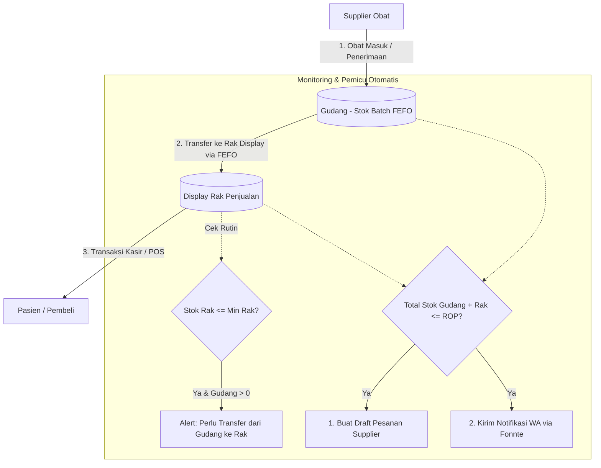

# Perancangan Sistem Informasi Manajemen Stok Obat
### Studi Kasus: Apotek Tabah Farma — Implementasi Laravel + FEFO + ROP + Fonnte (Multi-Lokasi: Gudang & Display Rak + POS Kasir)

---

## 1. Arsitektur & Tech Stack

| Komponen | Pilihan | Catatan |
|---|---|---|
| Framework | Laravel 11 | Arsitektur MVC, Eloquent ORM, Service Layer Pattern |
| Database | MySQL | Relasional dengan ACID Transaction untuk konsistensi stok |
| Autentikasi | Laravel Breeze / Session Guard | Role-based: `admin`, `karyawan` (kasir/petugas gudang) |
| Notifikasi WA | Fonnte API | Integrasi WhatsApp Gateway untuk peringatan ROP & ED |
| Frontend | Blade + Tailwind CSS (TailAdmin Theme) | Responsif, Dark/Light mode, SVG Icons |
| Scheduler | Laravel Task Scheduling (`schedule:run`) | Pengecekan otomatis ROP & ED (Expired Date) harian |
| Queue | Database Queue Driver | Kirim notifikasi WA secara asinkron tanpa membebani kasir |
| Testing | PHPUnit + BlackBox Testing | Pengujian fungsional skenario bisnis apotek |

---

## 2. Ringkasan Revisi Perancangan Sistem

| Aspek | Perancangan Awal | Revisi Final (Multi-Lokasi) | Alasan Perubahan |
|---|---|---|---|
| **Aliran Stok Obat** | Langsung Obat Masuk $\rightarrow$ Obat Keluar umum | **Gudang (FEFO)** $\rightarrow$ **Transfer Rak** $\rightarrow$ **Kasir (POS)** | Menyesuaikan operasional nyata apotek: stok disimpan di gudang, dipajang di rak display, lalu dibeli pasien di kasir. |
| **Lokasi Stok** | 1 Kolom `stok_sisa` per batch | Kolom `stok_gudang` dan `stok_rak` di tabel `obat_batch` | Melacak keberadaan fisik stok obat secara presisi tanpa redundansi data. |
| **Penerapan FEFO** | Hanya saat obat keluar | **2 Titik FEFO**: (1) Transfer Gudang $\rightarrow$ Rak, (2) Pengurangan di Kasir | Menjamin obat yang memiliki ED terdekat keluar lebih dulu dari gudang ke rak, dan dari rak ke pembeli. |
| **Skema Pemicu ROP** | Berdasarkan stok tunggal | **Berdasarkan Total Stok Apotek** ($Stok\ Gudang + Stok\ Rak$) | Jika rak kosong tapi gudang masih ada stok, cukup lakukan *transfer rak*. Pesan ke supplier hanya saat *total stok apotek* $\le ROP$. |
| **Alert Restock Rak** | Tidak ada | Alert jika `stok_rak` $\le$ `min_stok_rak` | Memberi peringatan visual kepada petugas untuk segera mengisi ulang rak dari gudang. |
| **Transaksi Keluar** | Form pengeluaran manual | **Sistem Kasir (Point of Sales)** | Mengakomodasi penjualan harian pasien/konsumen dengan struk/riwayat transaksi. |

---

## 3. Skema Alur Bisnis & ROP (Flowchart & Diagram)



### Rumus Perhitungan ROP (Reorder Point)
$$ROP = (d \times L) + SS$$
- **$d$ (Demand)**: Rata-rata pemakaian/penjualan obat per hari (diambil dari agregasi data transaksi kasir).
- **$L$ (Lead Time)**: Waktu tunggu pengiriman dari supplier sejak pesanan dibuat (dalam hari).
- **$SS$ (Safety Stock)**: Batas stok pengaman untuk mengantisipasi keterlambatan atau lonjakan pembelian.

> **Aturan Keputusan ROP:**
> - **Total Stok Apotek** = $\sum (stok\_gudang + stok\_rak)$
> - Jika **Total Stok $\le$ ROP Minimum**: Sistem langsung memicu draft **Pemesanan ke Supplier** dan mengirim **Pesan WhatsApp via Fonnte** ke Admin.

---

## 4. Skema Database Lengkap (Laravel Migration)

```php
use Illuminate\Database\Migrations\Migration;
use Illuminate\Database\Schema\Blueprint;
use Illuminate\Support\Facades\Schema;

// 1. Tabel Pengguna (Users)
Schema::create('users', function (Blueprint $table) {
    $table->id();
    $table->string('nama_user');
    $table->string('username')->unique();
    $table->string('password');
    $table->enum('role', ['admin', 'karyawan'])->default('karyawan');
    $table->rememberToken();
    $table->timestamps();
});

// 2. Tabel Supplier
Schema::create('supplier', function (Blueprint $table) {
    $table->id();
    $table->string('nama_supplier');
    $table->string('kontak')->nullable(); // Nomor WhatsApp untuk ROP
    $table->text('alamat')->nullable();
    $table->timestamps();
});

// 3. Tabel Master Obat
Schema::create('obat', function (Blueprint $table) {
    $table->id();
    $table->string('kode_obat')->unique();
    $table->string('nama_obat');
    $table->string('kategori')->nullable();
    $table->string('satuan');
    $table->decimal('harga', 12, 2)->default(0);
    $table->integer('rop_minimum')->default(10); // Titik pemesanan ke supplier
    $table->integer('min_stok_rak')->default(5);  // Titik minimum restock rak dari gudang
    $table->timestamps();
});

// 4. Tabel Batch Obat (Pelacakan FEFO & Multi-Lokasi)
Schema::create('obat_batch', function (Blueprint $table) {
    $table->id();
    $table->foreignId('obat_id')->constrained('obat')->cascadeOnDelete();
    $table->foreignId('supplier_id')->nullable()->constrained('supplier')->nullOnDelete();
    $table->string('nomor_batch');
    $table->date('tanggal_masuk');
    $table->date('tanggal_kadaluwarsa'); // Kunci utama algoritma FEFO
    $table->integer('stok_awal');
    $table->integer('stok_gudang')->default(0); // Sisa stok di gudang
    $table->integer('stok_rak')->default(0);    // Sisa stok di display rak
    $table->decimal('harga_beli', 12, 2)->default(0);
    $table->timestamps();
});

// 5. Tabel Riwayat Transfer Gudang ke Rak (FEFO Gudang)
Schema::create('transfer_rak', function (Blueprint $table) {
    $table->id();
    $table->foreignId('obat_id')->constrained('obat');
    $table->foreignId('obat_batch_id')->constrained('obat_batch');
    $table->foreignId('user_id')->constrained('users');
    $table->integer('jumlah');
    $table->date('tanggal_transfer');
    $table->string('keterangan')->nullable();
    $table->timestamps();
});

// 6. Tabel Transaksi Penjualan Kasir (POS)
Schema::create('penjualan', function (Blueprint $table) {
    $table->id();
    $table->string('no_transaksi')->unique(); // contoh: TRX-20260814-0001
    $table->foreignId('user_id')->constrained('users'); // Kasir
    $table->dateTime('tanggal_transaksi');
    $table->decimal('total_harga', 14, 2);
    $table->decimal('nominal_bayar', 14, 2);
    $table->decimal('kembalian', 14, 2);
    $table->string('nama_pembeli')->nullable();
    $table->text('catatan')->nullable();
    $table->timestamps();
});

// 7. Tabel Detail Penjualan (Potong Stok Rak via FEFO)
Schema::create('detail_penjualan', function (Blueprint $table) {
    $table->id();
    $table->foreignId('penjualan_id')->constrained('penjualan')->cascadeOnDelete();
    $table->foreignId('obat_id')->constrained('obat');
    $table->foreignId('obat_batch_id')->constrained('obat_batch'); // Batch rak yang terpakai
    $table->integer('jumlah');
    $table->decimal('harga_satuan', 12, 2);
    $table->decimal('subtotal', 14, 2);
    $table->timestamps();
});

// 8. Tabel Pemesanan ke Supplier (ROP)
Schema::create('pesanan', function (Blueprint $table) {
    $table->id();
    $table->string('kode_pesanan')->unique();
    $table->foreignId('supplier_id')->constrained('supplier');
    $table->foreignId('user_id')->nullable()->constrained('users');
    $table->date('tanggal_pesan');
    $table->enum('status', ['draft', 'diproses', 'dikirim', 'selesai', 'batal'])->default('draft');
    $table->text('catatan')->nullable();
    $table->timestamps();
});

// 9. Tabel Detail Pemesanan
Schema::create('detail_pesanan', function (Blueprint $table) {
    $table->id();
    $table->foreignId('pesanan_id')->constrained('pesanan')->cascadeOnDelete();
    $table->foreignId('obat_id')->constrained('obat');
    $table->integer('jumlah_pesan');
    $table->decimal('estimasi_harga', 12, 2)->default(0);
    $table->timestamps();
});

// 10. Tabel Log Notifikasi (WhatsApp Fonnte)
Schema::create('notifikasi', function (Blueprint $table) {
    $table->id();
    $table->foreignId('obat_id')->nullable()->constrained('obat');
    $table->enum('jenis_notifikasi', ['stok_menipis', 'mendekati_kadaluwarsa', 'restock_rak']);
    $table->text('pesan');
    $table->string('target_nomor');
    $table->enum('status', ['pending', 'terkirim', 'gagal'])->default('pending');
    $table->string('fonnte_id')->nullable();
    $table->timestamp('dikirim_at')->nullable();
    $table->timestamps();
});
```

---

## 5. Implementasi Logika Service Inti (Stok & Kasir)

### 5.1 Service Stok (`app/Services/StokService.php`)

```php
namespace App\Services;

use App\Models\Obat;
use App\Models\ObatBatch;
use App\Models\TransferRak;
use App\Models\Penjualan;
use App\Models\DetailPenjualan;
use App\Models\Notifikasi;
use App\Jobs\KirimNotifikasiWhatsapp;
use Illuminate\Support\Facades\DB;
use Exception;

class StokService
{
    /**
     * 1. Transfer Stok dari Gudang ke Rak Display (FEFO Gudang)
     */
    public function transferKeRak(int $obatId, int $jumlah, int $userId, ?string $keterangan = null): array
    {
        return DB::transaction(function () use ($obatId, $jumlah, $userId, $keterangan) {
            $obat = Obat::findOrFail($obatId);
            $totalGudang = $obat->batches()->sum('stok_gudang');

            if ($totalGudang < $jumlah) {
                throw new Exception("Stok di gudang tidak mencukupi. Tersedia: {$totalGudang} {$obat->satuan}");
            }

            $sisa = $jumlah;
            $batchDipindahkan = [];

            // Ambil batch gudang urut ED terdekat (FEFO)
            $batches = ObatBatch::where('obat_id', $obatId)
                ->where('stok_gudang', '>', 0)
                ->orderBy('tanggal_kadaluwarsa', 'asc')
                ->lockForUpdate()
                ->get();

            foreach ($batches as $batch) {
                if ($sisa <= 0) break;

                $ambil = min($batch->stok_gudang, $sisa);
                $batch->decrement('stok_gudang', $ambil);
                $batch->increment('stok_rak', $ambil);

                TransferRak::create([
                    'obat_id' => $obatId,
                    'obat_batch_id' => $batch->id,
                    'user_id' => $userId,
                    'jumlah' => $ambil,
                    'tanggal_transfer' => now(),
                    'keterangan' => $keterangan ?? "Transfer stok ke display rak",
                ]);

                $batchDipindahkan[] = [
                    'nomor_batch' => $batch->nomor_batch,
                    'jumlah' => $ambil,
                    'ed' => $batch->tanggal_kadaluwarsa
                ];

                $sisa -= $ambil;
            }

            return $batchDipindahkan;
        });
    }

    /**
     * 2. Transaksi Kasir / Penjualan (FEFO Rak) & Pengecekan ROP Otomatis
     */
    public function prosesPenjualan(array $dataTransaksi, array $items, int $userId): Penjualan
    {
        return DB::transaction(function () use ($dataTransaksi, $items, $userId) {
            $penjualan = Penjualan::create([
                'no_transaksi' => 'TRX-' . date('YmdHis') . '-' . rand(10, 99),
                'user_id' => $userId,
                'tanggal_transaksi' => now(),
                'total_harga' => $dataTransaksi['total_harga'],
                'nominal_bayar' => $dataTransaksi['nominal_bayar'],
                'kembalian' => $dataTransaksi['kembalian'],
                'nama_pembeli' => $dataTransaksi['nama_pembeli'] ?? 'Umum',
                'catatan' => $dataTransaksi['catatan'] ?? null,
            ]);

            foreach ($items as $item) {
                $obat = Obat::findOrFail($item['obat_id']);
                $qtyBeli = $item['jumlah'];

                $stokRakTersedia = $obat->batches()->sum('stok_rak');
                if ($stokRakTersedia < $qtyBeli) {
                    throw new Exception("Stok di rak untuk obat {$obat->nama_obat} tidak mencukupi (Tersisa: {$stokRakTersedia}). Silakan lakukan Transfer dari Gudang.");
                }

                $sisa = $qtyBeli;
                // Kurangi dari batch rak yang ED-nya paling dekat (FEFO)
                $batchesRak = ObatBatch::where('obat_id', $obat->id)
                    ->where('stok_rak', '>', 0)
                    ->orderBy('tanggal_kadaluwarsa', 'asc')
                    ->lockForUpdate()
                    ->get();

                foreach ($batchesRak as $batch) {
                    if ($sisa <= 0) break;

                    $ambil = min($batch->stok_rak, $sisa);
                    $batch->decrement('stok_rak', $ambil);

                    DetailPenjualan::create([
                        'penjualan_id' => $penjualan->id,
                        'obat_id' => $obat->id,
                        'obat_batch_id' => $batch->id,
                        'jumlah' => $ambil,
                        'harga_satuan' => $obat->harga,
                        'subtotal' => $ambil * $obat->harga,
                    ]);

                    $sisa -= $ambil;
                }

                // 3. Evaluasi Otomatis: ROP Keseluruhan & Status Rak
                $this->cekRopDanRak($obat->fresh());
            }

            return $penjualan;
        });
    }

    /**
     * 3. Logika Pengecekan ROP (Total Apotek) & Ambang Batas Display Rak
     */
    public function cekRopDanRak(Obat $obat): void
    {
        $stokGudang = $obat->batches()->sum('stok_gudang');
        $stokRak = $obat->batches()->sum('stok_rak');
        $totalApotek = $stokGudang + $stokRak;

        // A. Pemicu ROP (Pemesanan Supplier)
        if ($totalApotek <= $obat->rop_minimum) {
            $pesan = "⚠️ *PERINGATAN ROP (Stok Menipis)*\n"
                   . "Obat: *{$obat->nama_obat}*\n"
                   . "Sisa Total Apotek: *{$totalApotek} {$obat->satuan}* (Gudang: {$stokGudang}, Rak: {$stokRak})\n"
                   . "Batas ROP: *{$obat->rop_minimum} {$obat->satuan}*\n"
                   . "Sistem menyarankan segera melakukan pemesanan ulang ke supplier.";

            $notif = Notifikasi::create([
                'obat_id' => $obat->id,
                'jenis_notifikasi' => 'stok_menipis',
                'pesan' => $pesan,
                'target_nomor' => config('services.fonnte.admin_phone', '08123456789'),
                'status' => 'pending'
            ]);

            KirimNotifikasiWhatsapp::dispatch($notif);
        }
    }
}
```

---

## 6. Struktur Menu & Role Hak Akses

```
┌─────────────────────────────────────────────────────────────┐
│                   APOTEK TABAH FARMA                        │
├──────────────────────────────┬──────────────────────────────┤
│ ADMIN (Pengelola & Owner)    │ KARYAWAN (Kasir & Petugas)   │
├──────────────────────────────┼──────────────────────────────┤
│ 1. Dashboard Eksekutif       │ 1. Dashboard Operasional     │
│ 2. Display Rak & Alert Min   │ 2. Display Rak (Cek Stok)    │
│ 3. Kasir (POS & Riwayat)     │ 3. Kasir (Transaksi Pasien)  │
│ 4. Data Master (Obat & Sup)  │ 4. Data Master (Katalog Obat)│
│ 5. Gudang (FEFO & Transfer)  │ 5. Gudang (Masuk & Transfer) │
│ 6. Pemesanan (ROP)           │                              │
│ 7. Laporan Lengkap           │                              │
│ 8. Kelola Pengguna           │                              │
└──────────────────────────────┴──────────────────────────────┘
```

---

## 7. Rencana Pengujian Fungsional (BlackBox Test Matrix)

| ID Uji | Modul / Skenario | Langkah Input / Kondisi | Hasil yang Diharapkan |
|---|---|---|---|
| **BB-01** | Penerimaan Obat Masuk | Input batch baru dengan No. Batch & ED | Stok bertambah di `stok_gudang`, status batch aktif |
| **BB-02** | Transfer Gudang ke Rak | Transfer obat sejumlah $N$ dari gudang ke rak | Sistem otomatis memotong `stok_gudang` dari batch ED terdekat (FEFO) dan menambah `stok_rak` |
| **BB-03** | Validasi Transfer Rak | Transfer jumlah > total stok gudang | Muncul pesan error validasi, transaksi dibatalkan |
| **BB-04** | Transaksi Kasir | Penjualan obat di menu Kasir | `stok_rak` berkurang sesuai batch FEFO di rak, struk penjualan tercetak |
| **BB-05** | Validasi Stok Kasir | Beli jumlah > stok di rak display | Transaksi ditolak, kasir diinstruksikan melakukan *Transfer Rak dari Gudang* |
| **BB-06** | Pemicu Otomatis ROP | Penjualan menyebabkan Total Apotek $\le$ ROP | Notifikasi ROP dibuat di database dan Job pengiriman WhatsApp via Fonnte terpicu |
| **BB-07** | Scheduler ED Harian | Batch dengan ED $\le 30$ hari | Notifikasi batch mendekati kadaluwarsa terkirim otomatis ke WhatsApp admin |
| **BB-08** | Hak Akses Role | Karyawan mencoba membuka URL `/pesanan` atau `/pengguna` | HTTP 403 Forbidden (Akses Ditolak) |
